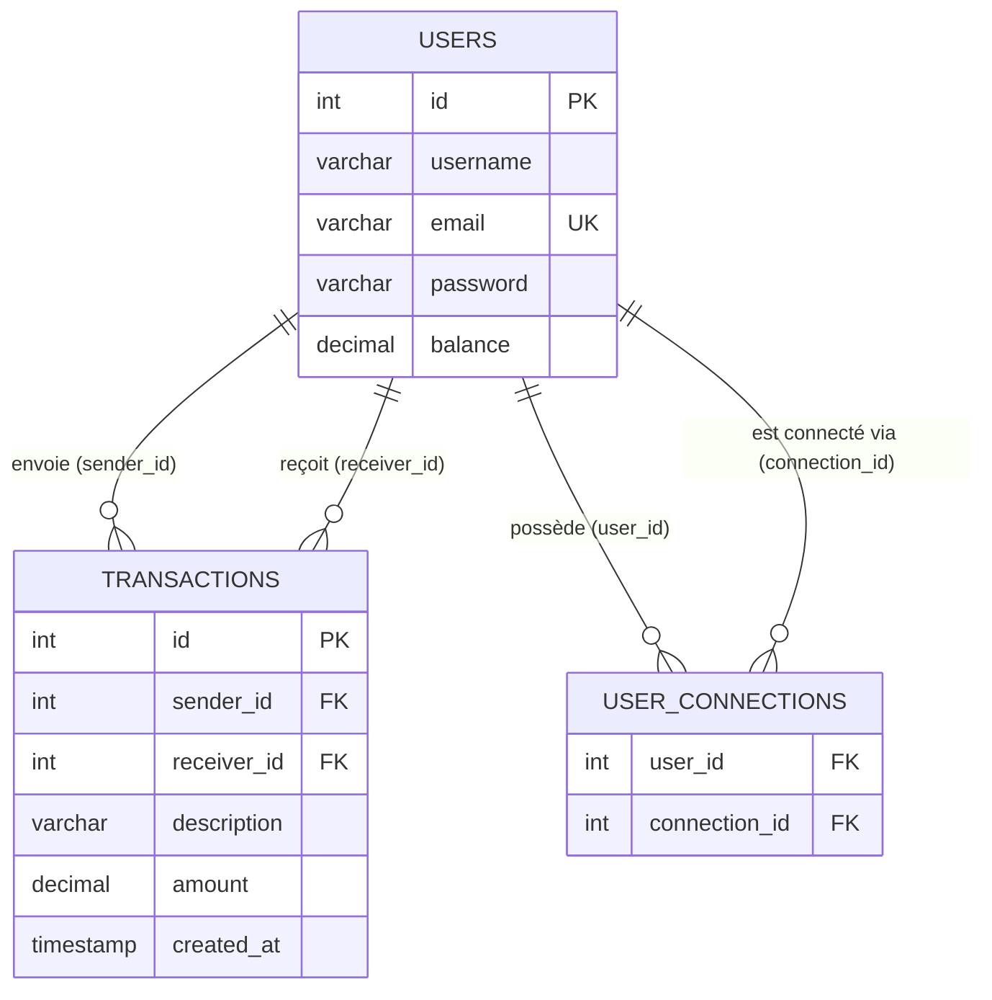

# Pay My Buddy

Application web de transfert d'argent entre amis.  
Développée avec Spring Boot 3, Spring Security, JPA/Hibernate et MySQL.

---

## Modèle Physique de Données (MPD)



---

## Stack technique

- Java 21
- Spring Boot 3.4
- Spring Security (BCrypt)
- Spring Data JPA / Hibernate
- MySQL 8
- Thymeleaf
- Maven

---

## Prérequis

- Java 21
- MySQL 8
- Maven

---

## Installation

1. Cloner le projet :

```bash
git clone https://github.com/votre-username/Pay_My_Buddy.git
cd Pay_My_Buddy
```

2. Créer la base de données MySQL :

```sql
CREATE DATABASE paymybuddy CHARACTER SET utf8mb4 COLLATE utf8mb4_unicode_ci;
```

3. Définir les variables d'environnement :

```bash
# Windows PowerShell
$env:DB_URL      = "jdbc:mysql://localhost:3306/paymybuddy"
$env:DB_USERNAME = "root"
$env:DB_PASSWORD = "votre_mot_de_passe"

# Mac / Linux
export DB_URL="jdbc:mysql://localhost:3306/paymybuddy"
export DB_USERNAME="root"
export DB_PASSWORD="votre_mot_de_passe"
```

4. Lancer l'application :

```bash
mvn spring-boot:run
```

L'application sera accessible sur [http://localhost:8080](http://localhost:8080)

---

## Structure du projet

```
src/
├── main/
│   ├── java/com/openclassrooms/Pay_My_Buddy/
│   │   ├── config/
│   │   │   └── SecurityConfig.java
│   │   └── PayMyBuddyApplication.java
│   └── resources/
│       ├── schema.sql
│       ├── data.sql
│       └── application.properties
└── test/
    └── java/com/openclassrooms/Pay_My_Buddy/
        └── PayMyBuddyApplicationTests.java
```

---

## Sauvegarde et restauration de la base de données

**Sauvegarde :**

```bash
mysqldump -u root -p paymybuddy > backup_paymybuddy.sql
```

**Restauration :**

```bash
mysql -u root -p paymybuddy < backup_paymybuddy.sql
```

> Pensez à effectuer une sauvegarde avant chaque mise à jour importante.

---

## Données de test

Un fichier `data.sql` est disponible dans `src/main/resources/` avec des utilisateurs et transactions fictifs.

Tous les comptes de test ont le mot de passe : **`password123`**

- **Alice Martin** — alice@email.com — 500,00€
- **Bob Dupont** — bob@email.com — 250,00€
- **Clara Petit** — clara@email.com — 100,00€
- **David Moreau** — david@email.com — 750,00€

Pour charger les données de test, ajoutez dans `application.properties` :

```properties
spring.sql.init.data-locations=classpath:data.sql
```

---

## Sécurité

- Les mots de passe sont hashés avec **BCrypt**
- Les identifiants de base de données sont injectés via des **variables d'environnement**
- Le fichier `application.properties` est exclu du dépôt Git (`.gitignore`)