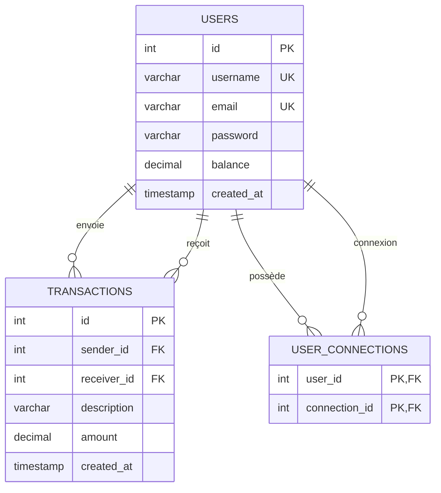

# Pay My Buddy

Application web de transfert d'argent entre amis.
Développée avec Spring Boot 3.5, Spring Security, JPA/Hibernate et MySQL.

---

## Modèle Physique de Données (MPD)



---

## Stack technique

- Java 21
- Spring Boot 3.5
- Spring Security (BCrypt)
- Spring Data JPA / Hibernate
- MySQL 8
- Thymeleaf
- Maven

---

## Prérequis

- Java 21
- MySQL 8
- Maven

---

## Installation

1. Cloner le projet :

```bash
git clone https://github.com/votre-username/Pay_My_Buddy.git
cd Pay_My_Buddy
```

2. Créer la base de données MySQL :

```sql
CREATE DATABASE paymybuddy CHARACTER SET utf8mb4 COLLATE utf8mb4_unicode_ci;
```

3. Définir les variables d'environnement :

```bash
# Windows PowerShell
$env:DB_URL      = "jdbc:mysql://localhost:3306/paymybuddy"
$env:DB_USERNAME = "root"
$env:DB_PASSWORD = "votre_mot_de_passe"

# Mac / Linux
export DB_URL="jdbc:mysql://localhost:3306/paymybuddy"
export DB_USERNAME="root"
export DB_PASSWORD="votre_mot_de_passe"
```

4. Lancer l'application :

```bash
mvn spring-boot:run
```

L'application sera accessible sur [http://localhost:8080](http://localhost:8080)

---

## Structure du projet

```
src/
├── main/
│   ├── java/com/openclassrooms/Pay_My_Buddy/
│   │   ├── security/
│   │   │   └── SecurityConfig.java
│   │   ├── controller/
│   │   │   ├── AuthController.java
│   │   │   ├── HomeController.java
│   │   │   └── TransferController.java
│   │   ├── dto/
│   │   │   ├── RegisterDTO.java
│   │   │   ├── TransactionDTO.java
│   │   │   └── UserDTO.java
│   │   ├── exception/
│   │   │   ├── GlobalExceptionHandler.java
│   │   │   └── InsufficientBalanceException.java
│   │   ├── mapper/
│   │   │   └── Mapper.java
│   │   ├── model/
│   │   │   ├── Transaction.java
│   │   │   └── User.java
│   │   ├── repository/
│   │   │   ├── TransactionRepository.java
│   │   │   └── UserRepository.java
│   │   ├── service/
│   │   │   ├── CustomUserDetailsService.java
│   │   │   ├── TransactionService.java
│   │   │   └── UserService.java
│   │   └── PayMyBuddyApplication.java
│   └── resources/
│       ├── templates/
│       │   ├── fragments/
│       │   │   └── navbar.html
│       │   ├── add-connection.html
│       │   ├── error.html
│       │   ├── home.html
│       │   ├── login.html
│       │   ├── profile.html
│       │   ├── register.html
│       │   └── transfer.html
│       ├── schema.sql
│       ├── data.sql
│       └── application.properties
└── test/
    └── java/com/openclassrooms/Pay_My_Buddy/
        ├── controller/
        │   ├── AuthControllerTest.java
        │   ├── HomeControllerTest.java
        │   └── TransferControllerTest.java
        ├── service/
        │   ├── TransactionServiceTest.java
        │   └── UserServiceTest.java
        ├── integration/
        │   └── IntegrationTest.java
        └───PayMyBuddyApplicationTests.java
```

---

## Sauvegarde et restauration de la base de données

**Sauvegarde :**

```bash
mysqldump -u root -p paymybuddy > backup_paymybuddy.sql
```

**Restauration :**

```bash
mysql -u root -p paymybuddy < backup_paymybuddy.sql
```

> Pensez à effectuer une sauvegarde avant chaque mise à jour importante.

---

## Données de test

Un fichier `data.sql` est disponible dans `src/main/resources/` avec des utilisateurs et transactions fictifs.

Tous les comptes de test ont le mot de passe : **`password123`**

| Utilisateur | Email | Solde |
|---|---|---|
| Alice Martin | alice@email.com | 500,00 € |
| Bob Dupont | bob@email.com | 250,00 € |
| Clara Petit | clara@email.com | 100,00 € |
| David Moreau | david@email.com | 750,00 € |

---

## Sécurité

- Les mots de passe sont hashés avec **BCrypt**
- Les identifiants de base de données sont injectés via des **variables d'environnement**
- La protection **CSRF** est activée sur tous les formulaires
- Les routes sont sécurisées via **Spring Security**

---

## Tests

Lancer les tests avec le rapport de couverture JaCoCo :

```bash
mvn test
```

Le rapport HTML est généré dans `target/site/jacoco/index.html`.

Le seuil minimum de couverture est fixé à **80%**.